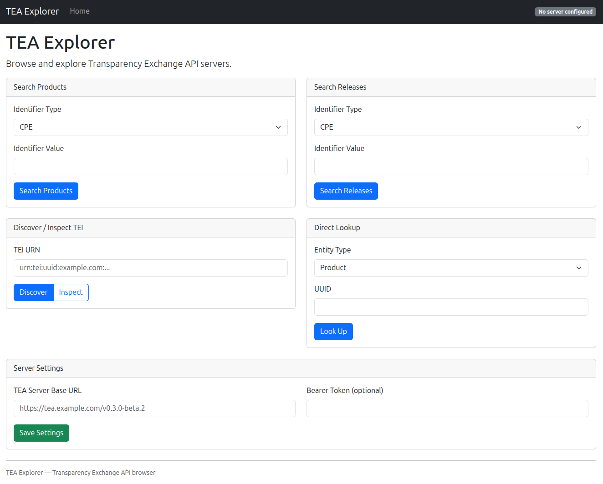

# CoderPatros.Tea.Client

A C# .NET client library for the [Transparency Exchange API (TEA)](https://github.com/CycloneDX/transparency-exchange-api) — the OWASP/ECMA TC54 standard for automating the exchange of software supply chain transparency artifacts (SBOMs, VEX, attestations, and more).

Targets the TEA specification **v0.3.0-beta.2**.

## Packages

| Package | Description |
| --- | --- |
| `CoderPatros.Tea.Client` | Core client library |
| `CoderPatros.Tea.Client.Extensions.DependencyInjection` | DI integration with `IHttpClientFactory` |

Install from NuGet:

```bash
dotnet add package CoderPatros.Tea.Client
dotnet add package CoderPatros.Tea.Client.Extensions.DependencyInjection
```

## TEA Explorer Web App

TEA Explorer is a web-based interface for browsing and exploring TEA servers. Built with ASP.NET Core Razor Pages, it provides a user-friendly way to search products and releases, discover TEI endpoints, inspect transparency artifacts, and look up entities by UUID.



### Running

```bash
# Run with Docker
docker run -p 8080:8080 coderpatros/tea-web

# Or run from source
dotnet run --project src/CoderPatros.Tea.Web
```

Configure a TEA server base URL and optional bearer token from the home page. Settings are stored in your browser session.

## CLI Tool

The `tea` CLI is a command-line interface for interacting with TEA servers. It is available as a .NET global tool or can be run directly from source.

### Installation

```bash
# Install as a .NET global tool
dotnet tool install --global CoderPatros.Tea.Cli

# Or download a standalone binary from GitHub releases
# https://github.com/coderpatros/dotnet-tea/releases
# Available for linux-x64, linux-arm64, osx-x64, osx-arm64, win-x64, win-arm64

# Or run from source
dotnet run --project src/CoderPatros.Tea.Cli -- --help
```

### Global Options

| Option | Description |
| --- | --- |
| `--base-url` | TEA server base URL (or set `TEA_BASE_URL` env var) |
| `--domain` | Discover TEA server via `.well-known/tea` for this domain |
| `--token` | Bearer token for authentication (or set `TEA_TOKEN` env var) |
| `--json` | Output raw JSON instead of formatted tables |
| `--timeout` | Request timeout in seconds (default: 30) |

### Commands

| Command | Description |
| --- | --- |
| `discover` | Discover TEA servers for a TEI |
| `search-products` | Search for products |
| `search-releases` | Search for product releases |
| `get-product` | Get a product by UUID |
| `get-release` | Get a product or component release by UUID |
| `get-collection` | Get the collection for a product or component release |
| `get-product-releases` | Get releases for a product |
| `get-component` | Get a component by UUID |
| `get-component-releases` | Get releases for a component |
| `list-collections` | List collections for a product or component release |
| `get-artifact` | Get an artifact by UUID |
| `get-cle` | Get Component Lifecycle Events (CLE) for an entity |
| `download` | Download an artifact and optionally verify checksums |
| `inspect` | Full inspection: discover TEI, list releases, collections, and artifacts |

### Examples

```bash
# Discover TEA servers for a TEI
tea discover urn:tei:purl:example.com:pkg:npm/express --base-url https://tea.example.com/tea/v1/

# Get a product by UUID
tea get-product 09e8c73b-ac45-4475-acac-33e6a7314e6d --base-url https://tea.example.com/tea/v1/

# Full inspection of a TEI (discover, releases, collections, artifacts)
tea inspect urn:tei:purl:example.com:pkg:npm/express

# Output as JSON
tea get-product 09e8c73b-ac45-4475-acac-33e6a7314e6d --json --base-url https://tea.example.com/tea/v1/

# Use environment variables instead of flags
export TEA_BASE_URL=https://tea.example.com/tea/v1/
export TEA_TOKEN=my-api-token
tea search-products --id-type PURL --id-value pkg:npm/express
```

### Local Development

Use the `run-cli.sh` script at the repository root to run the CLI without remembering the project path:

```bash
./run-cli.sh --help
./run-cli.sh get-product --base-url https://example.com/tea/v1/ <uuid>
```

## Requirements

- .NET 8.0 or later

## Getting Started

### Direct usage

```csharp
using CoderPatros.Tea.Client;

var httpClient = new HttpClient
{
    BaseAddress = new Uri("https://tea.example.com/tea/v1/")
};

var client = new TeaClient(httpClient);

// Get a product by UUID
var product = await client.GetProductAsync("09e8c73b-ac45-4475-acac-33e6a7314e6d");
Console.WriteLine($"{product.Name} has {product.Identifiers.Count} identifier(s)");

// Query products by PURL
var results = await client.QueryProductsAsync(
    idType: IdentifierType.PURL,
    idValue: "pkg:maven/org.apache.logging.log4j/log4j-api");
```

### With dependency injection

```csharp
using CoderPatros.Tea.Client.Extensions.DependencyInjection;

services.AddTeaClient(options =>
{
    options.BaseAddress = new Uri("https://tea.example.com/tea/v1/");
})
.AddBearerToken("your-api-token");
```

Then inject `ITeaClient` into your services:

```csharp
public class MyService(ITeaClient teaClient)
{
    public async Task CheckComponentAsync(string uuid)
    {
        var result = await teaClient.GetComponentReleaseAsync(uuid);
        var collection = result.LatestCollection;
        // ...
    }
}
```

## API Coverage

### Products

```csharp
await client.GetProductAsync(uuid);
await client.QueryProductsAsync(idType, idValue, pageOffset, pageSize);
await client.GetProductCleAsync(uuid);
```

### Product Releases

```csharp
await client.GetProductReleaseAsync(uuid);
await client.GetProductReleasesAsync(productUuid, pageOffset, pageSize);
await client.QueryProductReleasesAsync(idType, idValue, pageOffset, pageSize);
await client.GetProductReleaseCleAsync(uuid);
```

### Components

```csharp
await client.GetComponentAsync(uuid);
await client.GetComponentReleasesAsync(componentUuid);
await client.GetComponentCleAsync(uuid);
```

### Component Releases

```csharp
await client.GetComponentReleaseAsync(uuid);       // Returns release + latest collection
await client.GetComponentReleaseCleAsync(uuid);
```

### Collections

```csharp
// Product release collections
await client.GetProductReleaseLatestCollectionAsync(uuid);
await client.GetProductReleaseCollectionsAsync(uuid);
await client.GetProductReleaseCollectionAsync(uuid, collectionVersion);

// Component release collections
await client.GetComponentReleaseLatestCollectionAsync(uuid);
await client.GetComponentReleaseCollectionsAsync(uuid);
await client.GetComponentReleaseCollectionAsync(uuid, collectionVersion);
```

### Artifacts

```csharp
await client.GetArtifactAsync(uuid);
```

### Discovery

```csharp
await client.DiscoverByTeiAsync("urn:tei:uuid:products.example.com:d4d9f54a-abcf-11ee-ac79-1a52914d44b");
```

## TEI Parsing

Parse Transparency Exchange Identifiers (TEIs) directly:

```csharp
using CoderPatros.Tea.Client.Discovery;

var tei = Tei.Parse("urn:tei:purl:cyclonedx.org:pkg:pypi/cyclonedx-python-lib@8.4.0");
// tei.Type     == TeiType.Purl
// tei.Domain   == "cyclonedx.org"
// tei.Identifier == "pkg:pypi/cyclonedx-python-lib@8.4.0"

// Safe parsing
if (Tei.TryParse(input, out var parsed))
{
    Console.WriteLine(parsed!.Domain);
}
```

Supported TEI types: `uuid`, `purl`, `hash`, `swid`, `eanupc`, `gtin`, `asin`, `udi`.

## TEI Resolution

The `TeiResolver` implements the full discovery flow: parse TEI, fetch `.well-known/tea`, select the best endpoint by version compatibility and priority, then call `/discovery`:

```csharp
using CoderPatros.Tea.Client.Discovery;

var resolver = new TeiResolver(httpClient);
var results = await resolver.ResolveAsync("urn:tei:uuid:products.example.com:some-uuid");

foreach (var info in results)
{
    Console.WriteLine($"Product Release: {info.ProductReleaseUuid}");
    foreach (var server in info.Servers)
        Console.WriteLine($"  Server: {server.RootUrl} (versions: {string.Join(", ", server.Versions)})");
}
```

With DI, inject `ITeiResolver` directly (registered automatically by `AddTeaClient`).

## Authentication

### Bearer token

```csharp
// Static token
services.AddTeaClient(options => { ... })
    .AddBearerToken("my-token");

// Dynamic token provider
services.AddTeaClient(options => { ... })
    .AddBearerToken(async cancellationToken =>
    {
        // Fetch token from your auth provider
        return await GetTokenAsync(cancellationToken);
    });
```

### Mutual TLS

```csharp
services.AddTeaClient(options => { ... })
    .AddMutualTls("/path/to/client.pfx", "password");
```

Or pass an `X509Certificate2` instance directly:

```csharp
var cert = new X509Certificate2("/path/to/client.pfx", "password");
services.AddTeaClient(options => { ... })
    .AddMutualTls(cert);
```

## Error Handling

The client throws typed exceptions for different HTTP error responses:

| Exception | Status Code | Description |
| --- | --- | --- |
| `TeaBadRequestException` | 400 | Invalid request |
| `TeaAuthenticationException` | 401, 403 | Authentication or authorization failure |
| `TeaNotFoundException` | 404 | Object not found (includes parsed `ErrorResponse` with `OBJECT_UNKNOWN` or `OBJECT_NOT_SHAREABLE`) |
| `TeaApiException` | Other | Base exception for any other non-success status |

```csharp
try
{
    var product = await client.GetProductAsync(uuid);
}
catch (TeaNotFoundException ex) when (ex.ErrorResponse?.Error == ErrorType.OBJECT_NOT_SHAREABLE)
{
    Console.WriteLine("This object exists but is not shareable");
}
catch (TeaAuthenticationException)
{
    Console.WriteLine("Check your credentials");
}
```

## Building

```bash
dotnet build
dotnet test
dotnet pack
```

## License

Apache-2.0
